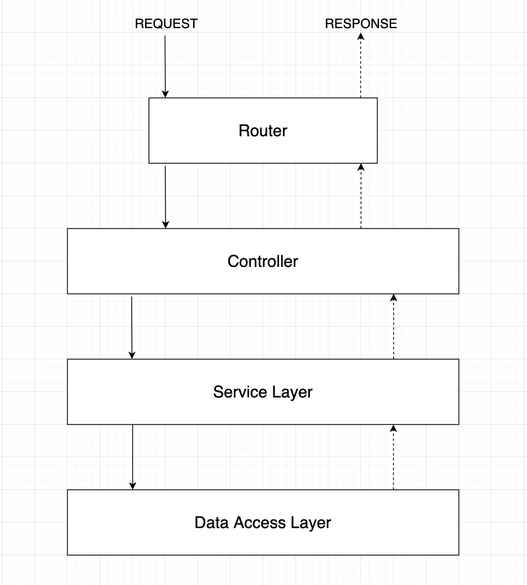

# Proyecto Integrador Backend

Desarrollo de una Api Rest con Node js, Express y Mongo DB.

## Instrucciones
<br />
<div align="center">
  <a href="https://github.com/abakudev/job-offers-api">
    
  </a>
</div>
<br />


## Como ejecutar la aplicación
### Pre-requisitos

* Instalar [Node.js®](https://nodejs.org/en/download/) y [NPM](https://www.npmjs.com/get-npm) si aún no están en su máquina.
* Verifique que está ejecutando al menos Node.js versión 12.x y npm versión 6.x o superior ejecutando node -v y npm -v en su terminal/consola.


### Instalar dependencias

Ejecutar el siguiente comando para instalar las dependencias.

<br/>

  ```
  npm install
  ```
<br/>

### Ejecutar aplicación

Ejecutar el siguiente comando para levantar el proyecto en localhost:8080

<br/>

  ```
  npm run dev
  ```
<br/>

### Postman

Importar el archivo "job-offers-api.postman_collection.json" en Postman.

  * [Como Importar Colección en Postman](https://learning.postman.com/docs/getting-started/importing-and-exporting-data/)

<br/>


### Arquitectura

Diagrama de arquitectura

<br />
<div align="center">
  <a href="https://github.com/abakudev/job-offers-api">
    
  </a>
</div>
<br />

## Author

 [Ekel Leal](https://github.com/Ekelhtml)